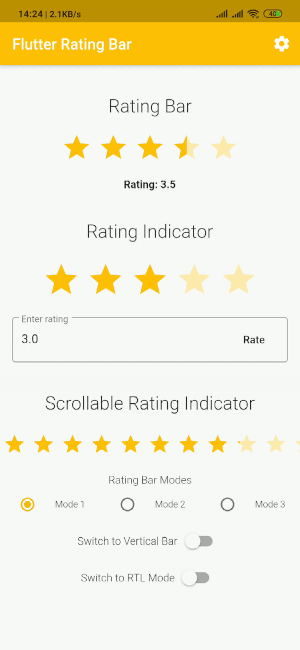
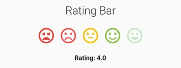
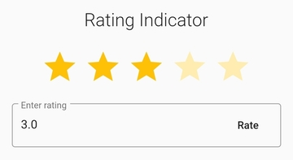
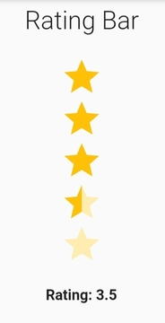

[](https://pub.dartlang.org/packages/flutter_rating_bar) 
[](https://github.com/sarbagyastha/flutter_rating_bar/blob/master/LICENSE)
[](https://sarbagyastha.com.np/flutter_rating_bar/)
[](https://github.com/sarbagyastha/flutter_rating_bar)
[](https://github.com/sarbagyastha/flutter_rating_bar)


A simple yet fully customizable rating bar for flutter which also include a rating bar indicator, supporting any fraction of rating.

 

## Salient Features
- Set minimum and maximum rating
- Any widgets can be used as as rating bar/indicator items
- Different widgets can be used in same rating bar as per position
- Supports vertical layout
- Glows on interaction
- Supports RTL mode

#### [Web Demo](https://sarbagyastha.com.np/flutter_rating_bar/)


## Usage

#### Using Flutter Rating Bar
Rating Bar can be used in three ways.

###### First Way:
Using `RatingBar.builder()`

 
```dart
RatingBar.builder(
   initialRating: 3,
   minRating: 1,
   direction: Axis.horizontal,
   allowHalfRating: true,
   itemCount: 5,
   itemPadding: EdgeInsets.symmetric(horizontal: 4.0),
   itemBuilder: (context, _) => Icon(
     Icons.star,
     color: Colors.amber,
   ),
   onRatingUpdate: (rating) {
     print(rating);
   },
);
```

###### Second Way:
Using `RatingBar()`

 
```dart
RatingBar(
   initialRating: 3,
   direction: Axis.horizontal,
   allowHalfRating: true,
   itemCount: 5,
   ratingWidget: RatingWidget(
     full: _image('assets/heart.png'),
     half: _image('assets/heart_half.png'),
     empty: _image('assets/heart_border.png'),
   ),
   itemPadding: EdgeInsets.symmetric(horizontal: 4.0),
   onRatingUpdate: (rating) {
     print(rating);
   },
);
```
Heart Icons are [Available Here](https://github.com/sarbagyastha/flutter_rating_bar/tree/master/example/assets).

###### Third Way:
Using `RatingBar.builder()` with index

 
```dart
RatingBar.builder(
    initialRating: 3,
    itemCount: 5,
    itemBuilder: (context, index) {
       switch (index) {
          case 0:
             return Icon(
                Icons.sentiment_very_dissatisfied,
                color: Colors.red,
             );
          case 1:
             return Icon(
                Icons.sentiment_dissatisfied,
                color: Colors.redAccent,
             );
          case 2:
             return Icon(
                Icons.sentiment_neutral,
                color: Colors.amber,
             );
          case 3:
             return Icon(
                Icons.sentiment_satisfied,
                color: Colors.lightGreen,
             );
          case 4:
              return Icon(
                Icons.sentiment_very_satisfied,
                color: Colors.green,
              );
       }
    },
    onRatingUpdate: (rating) {
      print(rating);
    },
;
```

#### Using Flutter Rating Bar Indicator

 
```dart
RatingBarIndicator(
    rating: 2.75,
    itemBuilder: (context, index) => Icon(
         Icons.star,
         color: Colors.amber,
    ),
    itemCount: 5,
    itemSize: 50.0,
    direction: Axis.vertical,
),
```

#### Vertical Mode
 

In order to make the indicator scrollable, just use 'physics' property as in the [example](https://github.com/sarbagyastha/flutter_rating_bar/blob/master/example/lib/main.dart).

## Info
To know more about the available properties, head on to [api docs](https://pub.dartlang.org/documentation/flutter_rating_bar/latest/flutter_rating_bar/flutter_rating_bar-library.html).

Feel Free to request any missing features or report issues [here](https://github.com/sarbagyastha/flutter_rating_bar/issues).

## License

```
Copyright (c) 2021 Sarbagya Dhaubanjar

Permission is hereby granted, free of charge, to any person obtaining a copy
of this software and associated documentation files (the "Software"), to deal
in the Software without restriction, including without limitation the rights
to use, copy, modify, merge, publish, distribute, sublicense, and/or sell
copies of the Software, and to permit persons to whom the Software is
furnished to do so, subject to the following conditions:

The above copyright notice and this permission notice shall be included in all
copies or substantial portions of the Software.

THE SOFTWARE IS PROVIDED "AS IS", WITHOUT WARRANTY OF ANY KIND, EXPRESS OR
IMPLIED, INCLUDING BUT NOT LIMITED TO THE WARRANTIES OF MERCHANTABILITY,
FITNESS FOR A PARTICULAR PURPOSE AND NONINFRINGEMENT. IN NO EVENT SHALL THE
AUTHORS OR COPYRIGHT HOLDERS BE LIABLE FOR ANY CLAIM, DAMAGES OR OTHER
LIABILITY, WHETHER IN AN ACTION OF CONTRACT, TORT OR OTHERWISE, ARISING FROM,
OUT OF OR IN CONNECTION WITH THE SOFTWARE OR THE USE OR OTHER DEALINGS IN THE
SOFTWARE.
```
